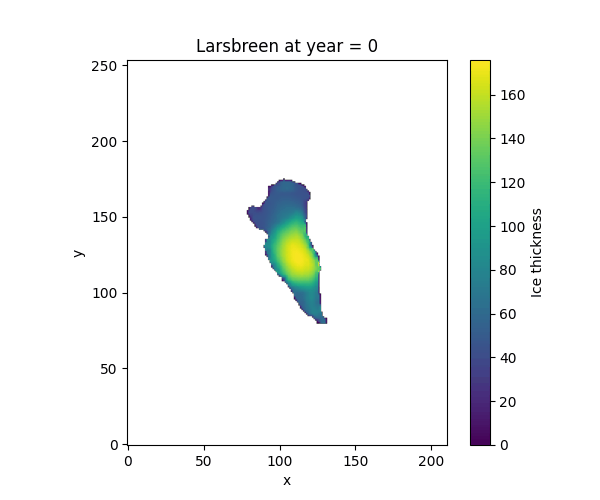
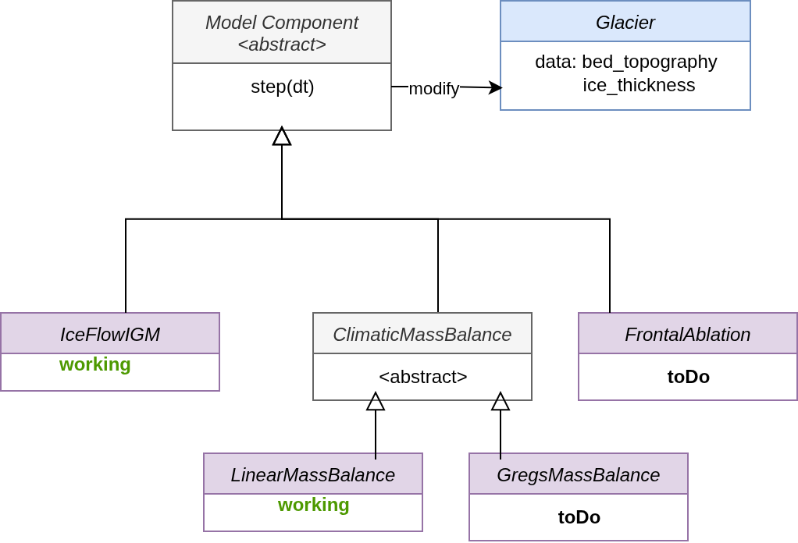

# UpGEM

---

## Class diagram (new)

---

## Structure diagram (old)

---

## Installation

Create a new conda environment and install the dependencies in `requirements.txt`.

There were problems with the IGM installation: it had to be done manually:
Overwrite the site-package `igm` with the ZIP download from github.

---

## Running the model

Execute `main.py`.

