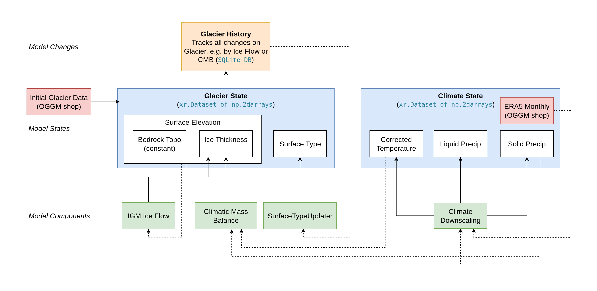

# Glacier Modeling Framework


A Glacier Modeling Framework built around a **Shared State Programming Architecture**.



---
## Most important code parts (from [main.py](https://github.com/joh-brunner/glacier-modeling-framework/blob/master/main.py))

```python
 # 1. Init data states
 glacier = Glacier()
 glacier.init_from_gridded_data(input_file)
 climate = Climate(glacier.data.sizes["y"], glacier.data.sizes["x"], glacier.data.attrs["dx"], climate_data_file)
```
```python
 # 2. Init model components with timesteps
 iceflow = IceFlowIGM(glacier, climate, "weekly")
 climate_downscaling = ClimateDownscaling(glacier, climate, "monthly")
 cmb = TIMassBalance(glacier, climate, "monthly")
 surface_type = SurfaceType(glacier, climate, "yearly")
```
```python
# 3. Define the order of your components
# If two components run on the same timestep, the one listed first will be executed first
model_components = [iceflow, climate_downscaling, cmb, surface_type]
```
```python
def run_model(model_components, start_date, simulation_years):
    # Create daily timeline (real calendar)
    start = pd.Timestamp(start_date)
    end = start + pd.DateOffset(years=simulation_years)
    times = pd.date_range(start=start, end=end, freq="D")

    for current_time in times:
        for comp in model_components:
            if comp.should_step(current_time):
                end_time = comp.get_end_time(current_time)
                comp.step(current_time, end_time)

```
---

## First results


---

## Original structure diagram idea


---

## Installation

Create a new conda environment and install the dependencies in `requirements.txt`.

There were problems with the ncdf version in the IGM installation: it had to be done manually:
Overwrite the site-package `igm` with the ZIP download from github.

---

## Running the model

Execute `main.py`.

---

## Ideas

- Develop the GlacierMIP standardization output in the framework
- Try OGGM/glacier3dviz for visualization of the output 

